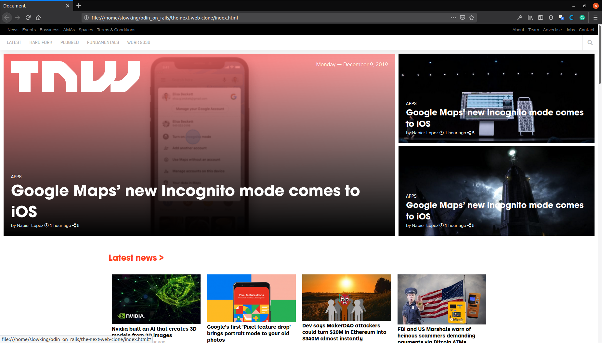

# Building with Responsive Design
> This project consists of replicating the [The Next Web](https://thenextweb.com/) website putting emphasis on how it behaves differently depending on the size of the screen where the website is rendered.

## Details
### Navbar
For the *Navbar*, we actually used two `<nav>` elements, the first one for the links on the black topbar and the second one for the actual navigation bar fixed at the top. There is also a *search* icon on this last one and once the viewport becomes small enough a *menu* icon becomes visible while the rest of the links disappear. The black topbar also hides on smaller screens and the logo jumps from the first article to this navbar as well

### Trending top section
This part behaves peculiarly. The main article takes 2/3 of the width of the block and the full height while the other two take the rest of the space. However, once the viewport becomes smaller, all the articles size is the same (full width and 1/3 of the height). Also, the page logo is within the big main article until this gets rearranged.

### Latest News section
All of this articles were arranged by putting everything inside a *flexbox* with the property `flex-wrap: wrap`, then we added a relative value to its *width* based on how many columns we wanted at each screen **breakpoint** (e.g. to get four columns you need to put each element width to *25%*). The content wrapping on the *flexbox* will take care of the rows.

### Latest funding rounds section
This one was internally complex since it had a lot of elements inside with different colors, sizes, and backgrounds, however, once you deal with this the rest is just as simple as the previous one. The whole box behaves just like that and everything inside resizes according to the square dimensions. That said the responsiveness behaves a little different.

First of all, the subtitle of the section has an `<ul>` with three links, each one inside its own `<li>`. They are relatively aligned to the line (`display: inline-block`) but once the screen gets smaller the jump to the bottom of the title and align below each other (`display: block`). About the article boxes, at the first breakpoint, one of them directly disappears, once the viewport gets even smaller they just stack on top of each other.

### Topics article
These where internally complex just like the previous one but even simpler to resize since the won't change their size nor appearance, they will only wrap to the next row as the viewport gets smaller until they all are on a single column.

### Latest deals section
This one is the same as the **Latest news section**. They have the same structure so the same styles can be applied without problems. They even share `font-size`, `font-family`, and `color`.

### Footer
The footer is a big `
` which takes the entire screen width, its height is a fixed value and inside it has a bunch of *social links*, a small `<nav>` and a *copyright notice*. They all are aligned inline between them and the containers stack on top of each other.

For resizing they stay almost the same until the viewport is really small, then the largest paragraphs shrink its horizontal space and the bunch of links wrap on to the next row one after another.

## Built With
- HTML5, CSS
- VSCode

## Live Demo
You can check a liver version here:

## Author

👤 **Joseph Flores**
- Github: [@YoseptF](https://github.com/YoseptF)
- Twitter: [@Yosept__](https://twitter.com/Yosept__)
- Linkedin: [Joseph Flores](https://www.linkedin.com/in/joseph-flores-928505106/)

👤 **Diego Luna Granados**
- Github: [@SlowKingV](https://github.com/SlowKingV)
- Twitter: [@SlowKingVI](https://twitter.com/SlowKingVI)
- Linkedin: [Diego Luna Granados](https://www.linkedin.com/in/diego-luna-granados-64007b197/)
